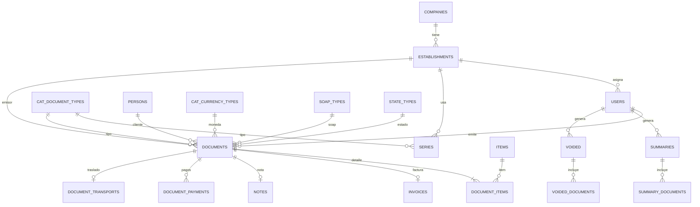

# ER Simplificado (Single Company)

Este proyecto queda orientado a **una sola empresa** operando en una sola base de datos.

## Nucleo operativo

- Empresa y configuracion: `companies`, `establishments`, `configurations`, `users`
- Maestros de emision: `series`, `persons`, `person_addresses`, `items`, `item_unit_types`, `item_sets`
- Comprobantes: `documents`, `document_items`, `invoices`, `notes`, `document_payments`, `document_transports`
- Resumenes SUNAT: `summaries`, `summary_documents`, `voided`, `voided_documents`
- Catalogos SUNAT: tablas `cat_*`, ademas de `soap_types`, `state_types`, `groups`
- Ubigeo: `countries`, `departments`, `provinces`, `districts`
- Tablas auxiliares: `accounts`, `banks`, `bank_accounts`, `exchange_rates`, `card_brands`, `payment_method_types`, `modules`, `module_user`, `password_resets`

## Limpieza automatica en Docker

El script `docker/db-cleanup-single-company.php` elimina tablas/campos legacy al iniciar el contenedor `app`.

Por defecto elimina:

- Tablas: `person_address`, `clients`, `hostnames`, `websites`, `plans`, `plan_module`, `tenant_migrations`
- Columnas: `configurations.locked_tenant`

Variables para extender la limpieza:

- `DB_CLEANUP_EXTRA_TABLES=tabla1,tabla2`
- `DB_CLEANUP_EXTRA_COLUMNS=tabla.columna,otra_tabla.otra_columna`

## Seeders actualizados (flujo actual)

Los seeders ahora son **no destructivos** para datos ya configurados en produccion:

- `database/seeds/UserSeeder.php`
  crea usuario admin solo si no existe por email (`SEED_ADMIN_EMAIL`) y no reescribe password/token existentes.
- `database/seeds/TenantDemoLiteSeeder.php`
  asegura base minima (establecimiento, configuracion, empresa principal opcional, series) sin sobrescribir datos existentes.
- Datos demo (clientes/items) solo cuando:
  `SEED_DEMO_DATA=true`

Variables utiles:

- `SEED_DEMO_DATA=false`
- `SEED_COMPANY_DEFAULTS=true`
- `SEED_ADMIN_EMAIL=admin@gmail.com`
- `SEED_ADMIN_PASSWORD=123456`
- `SEED_LEGACY_PLAN_DOCUMENTS=false`
